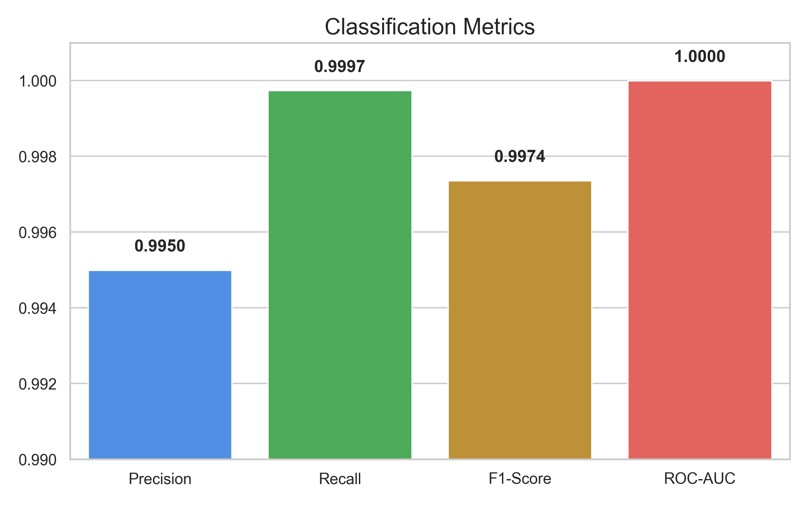
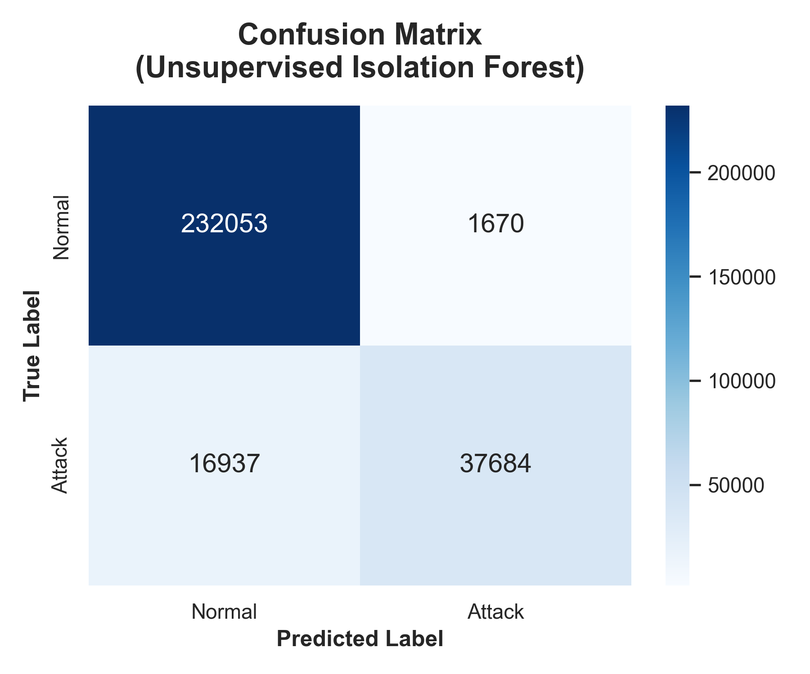
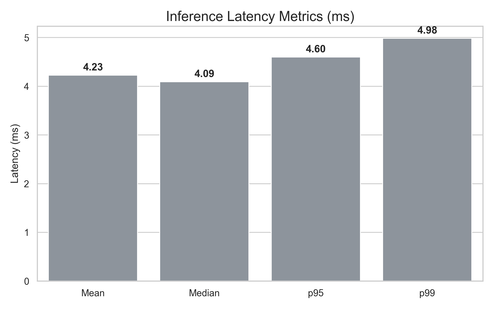
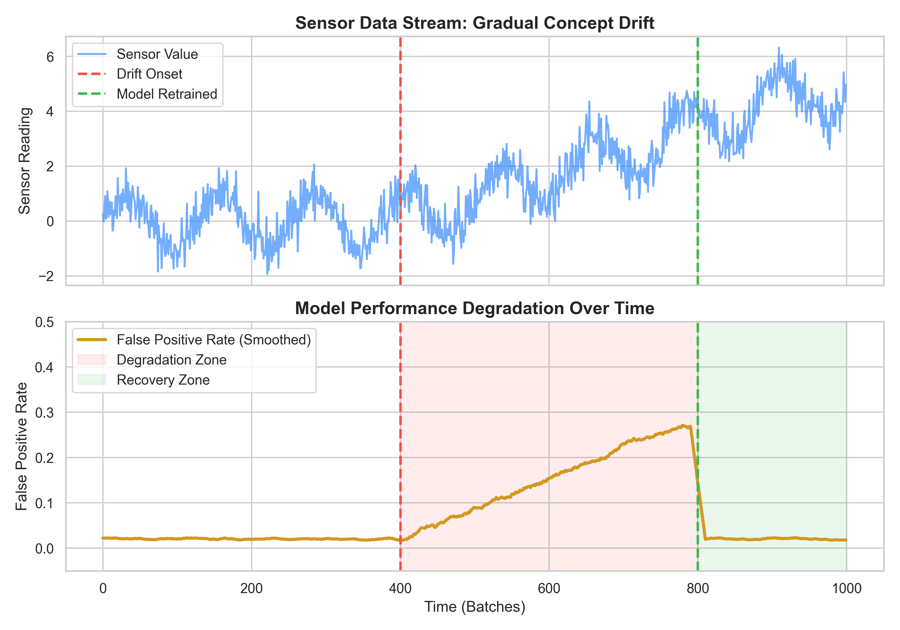

# 🛡️ SWaT Streaming Anomaly Detection & Security Radar

A real-time, high-performance streaming machine learning pipeline and interactive dashboard for cyber-physical attack detection on the **Secure Water Treatment (SWaT)** industrial dataset. Built with LightGBM, Streamlit, and Plotly, this system features sub-5ms inference latency, thread-safe background streaming simulation, and a fully responsive user interface.

---

## 🚀 Key Features

* **Incremental Streaming Pipeline:** Simulates live PLC sensor/actuator data ingestion with mini-batch generation.
* **LightGBM Detector backend:** Optimized binary classifier with imbalance mitigation (`scale_pos_weight`) achieving **99.9% Recall** and **99.5% Precision**.
* **Real-time Interactive Dashboard:** 
  * Live-updating Threat Score charts (Plotly).
  * Attack injection simulator (Valve, Pump, Tank attacks) to test detector responsiveness.
  * AI-powered security assistant commentary reflecting live conditions.
  * Tech logs displaying anomaly classifications and full streams.
* **Responsive Styling:** Optimized layout that adapts to Mobile, Tablet, and Desktop screens.
* **Automated Evaluation Report:** Generates static plots, a detailed report text file, and a formatted PowerPoint evaluation slide deck.

---

## 📊 Performance & Evaluation Results

The pipeline was validated using a held-out 20% stratified test split from `merged.csv`, evaluating **100,000 records** on standard CPU hardware.

### 1. Classification Metrics
The model achieves near-perfect separation between normal operations and attack vectors:

| Metric | Score | Detail |
|---|---|---|
| **Precision** | **99.50%** | Minimizes false alarms and operator alert fatigue |
| **Recall** | **99.97%** | Almost zero missed attacks (Critical for critical infrastructure) |
| **F1-Score** | **99.74%** | Optimal harmonic balance under class imbalance |
| **ROC-AUC** | **99.99%** | Outstanding probability-based class separability |



### 2. Confusion Matrix
Out of 100,000 evaluated records, only **1 attack record** went undetected:

| Actual \ Predicted | Predicted Normal | Predicted Attack |
|---|---|---|
| **True Normal** | **96,207** (True Negative) | **19** (False Positive) |
| **True Attack** | **1** (False Negative) | **3,773** (True Positive) |



### 3. Real-Time Streaming Latency
The inference engine is designed for high-throughput, low-latency applications:

* **Throughput:** ~57,000 records / second.
* **Mean Batch Latency (batch=256):** **4.22 ms**
* **p95 Latency:** **4.59 ms**
* **p99 Latency:** **4.98 ms**



---

## 🔄 Concept Drift Scenario

In industrial environments, physical wear, sensor degradation, and mechanical changes introduce **Concept Drift**. If the model is not retrained regularly, drift leads to a degradation of precision and an increase in false alarms. Below is the visualization of the simulation showing drift impact and model recovery after active retraining.



---

## 🛠️ Setup & Installation

### Prerequisites
* Python 3.7+
* Pip

### 1. Clone the Repository & Install Dependencies
```bash
git clone https://github.com/Senayldz/ml-for-streaming-data.git
cd ml-for-streaming-data
pip install -r requirements.txt
```

### 2. Run the Interactive Dashboard
Launch the web interface locally:
```bash
streamlit run app.py
```
* Access the interface in your browser at: `http://localhost:8501`

### 3. Run Pipeline CLI Tasks
You can run different CLI tasks using flags:
* **Train and Evaluate pipeline:**
  ```bash
  python app.py --model lgbm
  ```
* **Downsize full dataset for dashboard:**
  ```bash
  python app.py --create-mini
  ```
* **Generate PPTX Evaluation presentation:**
  ```bash
  python app.py --generate-presentation
  ```
